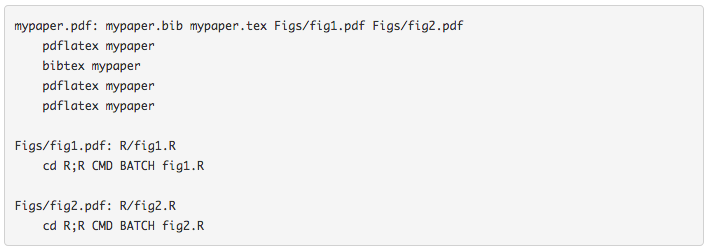

<!-- 
<!-- From here: https://slides.yihui.name/xaringan/ -->

```{r setup, include=FALSE}
options(htmltools.dir.version = FALSE)
library <- function(...) suppressPackageStartupMessages(base::library(...))
knitr::opts_chunk$set(
  tidy = TRUE
)
```

---
layout: true


---
class: left, middle

# About me

- Background in Data Analysis & Engineering

- In the past: I worked on 

- Right now: PostDoc @ EPFL `r icon::ii_arrow_right_a()` Analysis of genetic data in infectious diseases at the [Fellay Lab](https://fellay-lab.epfl.ch/).

- `r icon::fa_r_project(colour = "#88398a")`-Ladies Lausanne co-organiser


--

- `r icon::ii_heart()` Data analysis & Genetic data & Data visualisation

- `r icon::fa_question()` `usethis` package

---
class: center, middle, inverse

# My everyday work


---
class: left, middle

# What is the goal? 

1. Get the work done
1. Enable others to use your work (> otherwise its lost work)


---
class: left, middle

# Is that working in research? 

cite stodden

---
class: left, middle

# What are the problems? 

---
class: left, middle

# What are solutions?

- make/drake (for sequential execution)
- git/version control
- R projects
- online tools (stodden)
- R markdown
- packrat
- docker
- projectTemplate
- indenting + styleguides
- code review


---
class: left, middle


.small[Adapted from Figure in [R4DS book](http://r4ds.had.co.nz/explore-intro.html)]

---
class: left, middle


.small[Adapted from Figure in [R4DS book](http://r4ds.had.co.nz/explore-intro.html)]

---
class: left, middle


.small[Adapted from Figure in [R4DS book](http://r4ds.had.co.nz/explore-intro.html)]

---
class: inverse, center, middle

.big[<font face="Yanone Kaffeesatz"> Tidying workflows </font>] <!------`r icon::fa_smile()` ---------->

---
class: left, top

# The challenges

- Making it easy for other colleagues to **rerun** (and **understand**) the project → *"repeatability"*

--

- Publishing code 
  - making it easy for others to **rerun** and to **understand** the project → [*"reproducibility"*](https://twitter.com/jtleek/status/759822823552606208)
  - making it easy for others to rerun the code **with different data** → [*"replicability"*](https://twitter.com/jtleek/status/759822823552606208)

--

- Keeping up with **new data deliveries**, changing data formats, generally, data chaos. 

--

- Having an **overview of the analysis and its iteration steps** → cleaning, modelling, visualisation, reports.

--

- Separating `data`, `processed-data` and `output-data`

--

- Having **different places** for computation (PC, Server1, Server2).

--

- Using similar code in many different R scripts → **redundant** code 

---
class: center, middle


.small[Source: https://imgs.xkcd.com/comics/data_pipeline.png]

---
class: center, middle

# There is no magic solution

<a href="https://docs.google.com/presentation/d/1VK1hngMZSY3FT2SrDd4_AHiB28CHrsuSsaFr7r3SAL8/edit#slide=id.p">

</a>

.small[Extract from presentation by Heidi Seibold @HeidiBaya on [*Tools for reproducibility in Statistics and Machine Learning*](https://docs.google.com/presentation/d/1VK1hngMZSY3FT2SrDd4_AHiB28CHrsuSsaFr7r3SAL8/edit#slide=id.p)]


---
class: left, middle

# What we need

- **Tidy folders**
  - clear folder structure, e.g. `data`, `bin`, `code`, but not `data1`, `data2`, `code_old`
  - only files with "purposes" (no `B_mod_old.R`)

- **Clear instructions** → one file should contain a sort of **recipe** of the analysis.

- **Modular code** → using **functions** instead of free floating code.

- **Minimising** redundant computation → **caching** results.


---
class: left, middle

# R package folder structure

<a href="http://r-pkgs.had.co.nz/package.html">

</a>

.small[Figure from http://r-pkgs.had.co.nz/package.html.]

---
class: center, middle, inverse

# What are the options?


---
class: left, top

# The default aka. wild west

### Link to example

[https://github.com/sinarueeger/workflow-example/tree/master/wild-west](https://github.com/sinarueeger/workflow-example/tree/master/wild-west)

<!--- ------>

### Folder structure

```
wild-west/
├── code
│   ├── A_dataprep.R
│   ├── B_fit.R
│   └── functions.R
├── data
│   ├── genotyping_data_subset_train.bim
│   ├── genotyping_data_subset_train.raw
│   └── training_set_details.txt
├── report
│   └── report.Rmd
└── wild-west.Rproj
```


---
class: left, top

# Wild west "pro"

### Folder structure

```
wild-west-pro/
├── README.md
├── code
│   ├── A_dataprep.R
│   ├── B_fit.R
│   └── functions.R
├── data
│   ├── genotyping_data_subset_train.bim
│   ├── genotyping_data_subset_train.raw
│   └── training_set_details.txt
├── report
│   └── report.Rmd
└── wild-west-pro.Rproj
```

--
### + README file

- **Problem**: the `README.md` file needs to be updated.

---
class: left, top

# make



.small[From https://kbroman.org/minimal_make/]

- Variations of make, e.g. `stu`.

- **Problem**: what if colleagues don't know make?


---
class: left, top

# [Drake](https://github.com/ropensci/drake)

- drake = Data Frames in R for Make

- "general-purpose workflow manager for data-driven tasks"
  - borrows some features from make
  - caching of runs (future runs only start from the part where something has changed)
  - scalable (parallel computing)
  - supports easy maintainance of data analysis projects

- [rOpenSci](https://ropensci.org/) package → code is reviewed

- Created by [Will Landau](https://twitter.com/wmlandau), with contributions by many others.


---
class: left, middle

## `cd mini/` 

---
class: left, top

## Mini example to get familiar with drake (part 1)

1. `install.packages("drake")`
1. Check-out the different examples with `drake::drake_examples()`.
1. Run `drake::drake_example("main")` → this will download a folder called `main`.
1. `cd main/`

```
main/
├── COPYRIGHT.md
├── LICENSE.md
├── README.md
├── clean.R
├── make.R
├── raw_data.xlsx
└── report.Rmd
```

---
class: left, top

## Mini example to get familiar with drake (part 2)

1. Open `make.R`: key components are `drake_plan()` and `make()`. 
1. Add the following bit before and after `make(plan)`.
```
config <- drake_config(plan) 
vis_drake_graph(config) 
```
1. Run all code for a first time.
1. Change something (e.g. the plot function).
1. Rerun and watch the colors change in `vis_drake_graph(config)`.
1. Use functions `readd()` and `loadd()` to work with the produced output.

---
class: left, middle

## `cd drake-land/` 

---
class: left, top

## Example with our data

### Link to example

[https://github.com/sinarueeger/workflow-example/tree/master/drake-land](https://github.com/sinarueeger/workflow-example/tree/master/drake-land)

### Folder structure

```
drake-land/
├── data
│   ├── genotyping_data_subset_train.bim
│   ├── genotyping_data_subset_train.raw
│   └── training_set_details.txt
├── drake-land.Rproj
├── functions.R
├── make.R
└── report.Rmd
```


---
class: left, top

## More complex example

What if you have folders, instead of a *flat* folder structure?

### Link to example (*work-in-progress*)

[https://github.com/sinarueeger/workflow-example/tree/master/drake-land-adv](https://github.com/sinarueeger/workflow-example/tree/master/drake-land-adv)


```
drake-land-adv/
├── data
│   ├── genotyping_data_subset_train.bim
│   ├── genotyping_data_subset_train.raw
│   └── training_set_details.txt
├── src
│   ├── functions.R
│   ├── some-other-stuff.R
├── report
│   ├── drake-land-adv.Rproj
│   ├── make.R
│   ├── report.Rmd
```

<!---
cat(
  system(
    "tree ../drake-land",
    intern = TRUE),
  sep = "\n"
)
----->


---
class: left, middle

## .drake/


---
class: left, top

## Resources

- [Github Repo](https://github.com/ropensci/drake)

- [Best practices](https://ropensci.github.io/drake/articles/best-practices.html) for drake projects.

- How drake compares to [similar work](https://github.com/ropensci/drake#similar-work).

- Lots of [tutorials](https://github.com/ropensci/drake#tutorials) and [examples](https://github.com/ropensci/drake#examples).

- Check-out [this tutorial](https://github.com/krlmlr/drake-sib-zurich) by [Kirill Müller](https://twitter.com/krlmlr).

- [Cheatsheet](https://github.com/krlmlr/drake-sib-zurich/blob/master/cheat-sheet.pdf).

---
class: inverse, center, middle

.big[<font face="Yanone Kaffeesatz"> Diversity in the R community </font>] <!------`r icon::fa_smile()` ---------->


---
class: inverse, center, middle

.big[<font face="Yanone Kaffeesatz"> Thank you! </font>] <!------`r icon::fa_smile()` ---------->

.left[
Slides: [https://sinarueeger.github.io/20181004-geneve-rug/slides#1](https://sinarueeger.github.io/20181004-geneve-rug/slides#1)

Source code: [https://github.com/sinarueeger/20181004-geneve-rug/](https://github.com/sinarueeger/20181004-geneve-rug/)

Examples: [https://github.com/sinarueeger/workflow-example](https://github.com/sinarueeger/workflow-example)

`r icon::fa_twitter(colour = "white")`: [@sinarueeger](https://twitter.com/sinarueeger)
]
