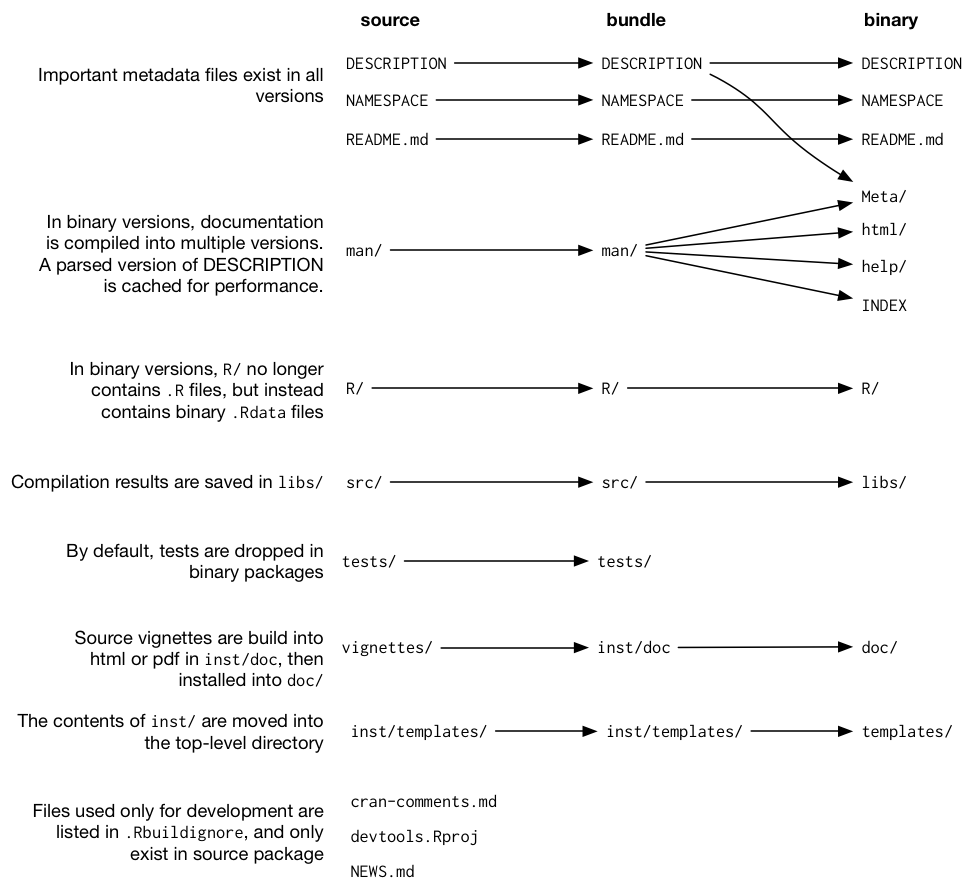

<!-- 
<!-- From here: https://slides.yihui.name/xaringan/ -->

```{r setup, include=FALSE}
options(htmltools.dir.version = FALSE)
library <- function(...) suppressPackageStartupMessages(base::library(...))
knitr::opts_chunk$set(
  tidy = TRUE,
  tidy.opts = list(blank = FALSE, width.cutoff = 40)
)
```

```{r, load_refs, echo=FALSE, cache=FALSE}
library(RefManageR)
BibOptions(check.entries = FALSE, 
           bib.style = "authoryear", 
           cite.style = 'alphabetic', ## authoryear
           style = "markdown",
           hyperlink = FALSE, 
           dashed = FALSE)
references <- ReadBib("references.bib", check = FALSE)
```


---
class: left, middle

# About me

- Background in Data Analysis & Engineering.

- In the past: I worked as a research assistant in data science, in epidemiology and in statistical genetics. 

- Right now: PostDoc @ EPFL `r icon::ii_arrow_right_a()` Analysis of genetic data in infectious diseases at the [Fellay Lab](https://fellay-lab.epfl.ch/).

- `r icon::fa_r_project(colour = "#88398a")`-Ladies Lausanne co-organiser.


---
class: left, middle

# Inspiration

- [**R-Ladies Remote Journal Club**](https://twitter.com/acastillogill/status/1067699852048510976) where we discussed *Good enough practices in scientific computing* `r Citep(references, "wilson-etal-2017")`. 

- **rOpenSci Community call**: *Code Review in the Lab* `r Citet(references, "ropensci-2018")` and the [summary](https://ropensci.org/blog/2018/11/29/codereview/) of it.

- Plus all the [references](#references) listed at the end.


---
class: center, middle, inverse

# Life cycle of projects


---
class: left, middle


.small[Adapted from Figure in [R4DS book](http://r4ds.had.co.nz/explore-intro.html)]

---
class: left, middle


.small[Adapted from Figure in [R4DS book](http://r4ds.had.co.nz/explore-intro.html)]

---
class: left, middle


.small[Adapted from Figure in [R4DS book](http://r4ds.had.co.nz/explore-intro.html)]


---
class: left, middle

# Goal

### 1. Figuring out stuff.

### 2. Telling others.

- Making it easy for yourself & colleagues to **rerun** (and **understand**) the project → *"repeatability"*. 
- Publishing code: 
    - making it easy for others to **rerun** and to **understand** the project → [*"reproducibility"*](https://twitter.com/jtleek/status/759822823552606208). 
    - making it easy for others to rerun the code **with different data** → [*"replicability"*](https://twitter.com/jtleek/status/759822823552606208). 


---
class: left, middle

# Is that working? 


.small[*Enhancing reproducibility for computational methods* `r Citet(references, "stodden-etal-2016")`]

---
class: left, middle 
exclude: true

# Problems

- Computers (Servers, OS, )
- Trained for domain x and not computing


---
class: left, middle

# Best practices


### Data management
### Code
### Project organisation 
### Version control

.small[A selection from *Good enough practices in scientific computing* `r Citet(references, "wilson-etal-2017")`]


---
class: center, middle

# ...extremely well organised scientists

<a href="https://docs.google.com/presentation/d/1VK1hngMZSY3FT2SrDd4_AHiB28CHrsuSsaFr7r3SAL8/edit#slide=id.p">

</a>

.small[Extract from presentation by Heidi Seibold @HeidiBaya on [*Tools for reproducibility in Statistics and Machine Learning*](https://docs.google.com/presentation/d/1VK1hngMZSY3FT2SrDd4_AHiB28CHrsuSsaFr7r3SAL8/edit#slide=id.p)]


---
class: left, middle
exclude: true

# What are solutions?

### Data Management
    - `janitor`

### Code
    - Style guides (`lintr`, `formatr`, `styler`)
    - `bannerCommenter`
    - work with rstudio projects and `here::here()`
    
### Project Organisation 
    - runall script: `drake`
    - directory structur: `ProjectTemplate`, `pRojects`, `rrtools`

### Version control / git


---
class: left, middle

# Creating *reviewable* projects

- Having an **overview of the analysis and its iteration steps** → cleaning, modelling, visualisation, reports.

- Well styled code makes it easier to apply **code review**.


<!----------------------------------->

---
class: inverse, center, middle

.large[Data Management]

---
class: left, middle

## Create data

> *Create the data you wish to see in the world* `r Citep(references, "wilson-etal-2017")`

- Pay attention to **variable names**.
- Use a **data dictionary** / codebook (variable meta data).
- Use and create **analysis friendly** data.


---
class: left, middle

## library(janitor)

```
library(janitor)
## remove empty table
janitor::remove_empty()

## remove duplicates
janitor::get_dupes(whatever, ID)

## clean names
iris %>% names()
janitor::clean_names(iris, case = "parsed") %>% names()
```


---
class: left, middle

## More

- `library(readxl)` and `library(googlesheets)` to work with spreadsheet data. 

- [`library(dataMeta)`](https://cran.r-project.org/web/packages/dataMeta/vignettes/dataMeta_Vignette.html) to create meta data of variables.


<!----------------------------------->


---
class: inverse, center, middle

.large[(Styling) Code]

---
class: left, middle

## Why styling code? 

Well *styled* code makes reviewing easier. 

---
class: left, middle

## In-built options in RStudio (1/4)

- **Reindent** Lines (Cmd+I) → proper indenting

- **Reformat** Code (Cmd+Shift+A) → adds spaces, breaks long horizontal code

↪ apply both with` mycode.R`:


---
class: left, middle

## Style guides (2/4)

Styleguides: a set of opinionated rules. 

- [`library(formatr)`](https://yihui.name/formatr/) 

- [`library(styler)`](https://github.com/r-lib/styler)

---
class: left, middle

### library(formatr)

Some more details on [Yihui Xie page](https://yihui.name/formatr/). Make sure you read *6. Further Notes* about all the bad things that can happen. 

- `formatR::tidy_file("mycode.R")` will change the R file

- `formatR::tidy_source("mycode.R")` will output the styled R code


---
class: left, middle

### Bad code

```{r,tidy=FALSE,results=FALSE}
make.background=function(N,filename        ){
cols <- c("#88398A","#B07FB2","#F7CCA4","#C8C05E","#627C63") ## generated here: http://colormind.io/

## colors
set.seed(3)
N=2000
df=data.frame(x=runif(N), y =runif(N), col = sample(cols, N, replace = TRUE), size=runif(N, 1, 10))

## no border
qp <- ggplot(df, aes(x, y))+ geom_point(aes(size =size, fill =I(col), color = I(col)), alpha = 0.4, shape = 16)+theme_void()+theme(legend.position="none")+scale_size_continuous(range = c(1, 30))

return(qp)
}
```


---
class: left, middle

### Better code

```{r, comment="", eval =F}
formatR::tidy_source("mycode.R", blank = FALSE, arrow = TRUE, width.cutoff = 50)
```

```{r, eval = FALSE}
make.background <- function(N, filename) {
    cols <- c("#88398A", "#B07FB2", "#F7CCA4", "#C8C05E", 
        "#627C63")  ## generated here: http://colormind.io/
    ## colors
    set.seed(3)
    N <- 2000
    df <- data.frame(x = runif(N), y = runif(N), col = sample(cols, 
        N, replace = TRUE), size = runif(N, 1, 10))
    ## no border
    qp <- ggplot(df, aes(x, y)) + geom_point(aes(size = size, 
        fill = I(col), color = I(col)), alpha = 0.4, 
        shape = 16) + theme_void() + theme(legend.position = "none") + 
        scale_size_continuous(range = c(1, 30))
    return(qp)
}
```

---
class: left, middle

### library(styler)

- Follows tidyverse styling rules. 
- RStudio add-in

↪ `mycode.R`: select parts, apply `style selection`

↪ `mycode.R`: apply `style active file`


---
class: left, middle

## Linter for R code (3/4)

- `library(lintr)`

- pretty sophisticated, static code analysis

- ↪ https://github.com/jimhester/lintr

```{r,eval=FALSE}
lintr::lint("mycode.R")
```

---
class: left, middle

## libary(bannerCommenter) (4/4)

- For a consistent **commenting style**.

- Checkout [bannerCommenter-vignette](https://cran.r-project.org/web/packages/bannerCommenter/vignettes/Banded_comment_maker.pdf) for more options. 

- Main function is `bannerCommenter::banner()`


---
class: left, middle


```{r, comment = ""}
bannerCommenter::banner("This is an R-script Title", "and this is a subtitle", emph = TRUE, numLines = 3)
```


---
class: left, middle


```{r, comment = ""}
bannerCommenter::banner("Section",
                        centre = TRUE,
                        bandChar = "/",
                        minHashes = 70)
```

---
class: left, middle


```{r, tidy = TRUE, comment = ""}
bannerCommenter::banner("Subsection",
                        centre = FALSE,
                        snug = TRUE,
                        bandChar = "-")
```


---
class: left, middle


```{r, tidy = TRUE, comment = ""}
bannerCommenter::open_box("Important note", bandChar = ":")
```


---
class: left, middle

### Lots of more options

- *emph*: bigger, bolder banner
- *snug*: box close fitting
- *upper*: text in upper case
- *centre*: text in centre
- *leftSideHashes*: nbr of hash characters to the left
- *rightSideHashes*: nbr of hash characters to the right
- *minHashes*: length of bands (e.g. 80)
- *numLines*: nbr of lines
- *bandChar*: type of character

   
---
class: left, middle

## More

- Work with RStudio projects and `here::here()` (if you need convincing, checkout [this blogpost](https://malco.io/2018/11/05/why-should-i-use-the-here-package/)).

- More on style guides: 
  - http://adv-r.had.co.nz/Style.html
  - http://jef.works/R-style-guide/#file-names


 
<!----------------------------------->
---
class: inverse, center, middle

.large[Project management]


---
class: left, middle

## Directory structure

- [`library(ProjectTemplate)`](http://projecttemplate.net/architecture.html)

- [`library(pRojects)`](https://itsalocke.com/projects/)

---
class: left, middle

### R package folder structure

<a href="http://r-pkgs.had.co.nz/package.html">

</a>

.small[Figure from http://r-pkgs.had.co.nz/package.html.]


---
class: left, middle

### library(ProjectTemplate)

- ↪ hhttp://projecttemplate.net/architecture.html

- ↪ hhttp://projecttemplate.net/getting_started.html

```{r, eval = FALSE}
library(help = ProjectTemplate)
create.project(project.name = "TB.analysis")
```

Minimal version creates folders: `cache, config, data, munge, README.md, src`

```{r, eval = FALSE}
create.project(project.name = "TB.analysis", template = "minimal")
```

```{r, eval = FALSE}
## cd into project
load.project()
```


---
class: left, middle

### library(pRojects)

- Create a project layout for an analysis project

- includes support for git, packrat

- ↪ https://itsalocke.com/projects/

```{r, eval = FALSE}
library(pRojects)
createAnalysisProject(name = "TB.analysis", 
                   title = "Analysis of TB data in NBR individuals of SOMENAME cohort", 
                   folder = "/Users/rueger/Documents", 
                   git = TRUE,
                   external_setup = NULL)
```

Customise: 
```{r, eval = FALSE}

createAnalysisProject(name = "TB.analysis", 
                      title = "Analysis of TB data in NBR individuals of SOMENAME cohort", 
                      folder = "/Users/rueger/Documents", 
                      git = TRUE,
                      external_setup = NULL,
                      dirs = c("data", "docs", "output", "src", "report"))

```


---
class: left, middle

### Self baked


```
yourproject/
├── README.md
├── code
│   ├── A_dataprep.R
│   ├── B_fit.R
│   └── functions.R
├── data
│   ├── raw
│   ├── processed
│   ├── results
├── report
│   └── report.Rmd
└── yourproject.Rproj
```


---
class: left, middle

## Runall script

- runall script in `.R`
- runall script in `.sh`
- Makefile
- `library(drake)`

---
class: left, middle

## Helps you with

- **Clear instructions** → one file should contain a sort of **recipe** of the analysis.

- **Modular code** → using **functions** instead of free floating code.

- **Minimising** redundant computation → **caching** results.


```
yourproject/
├── README.md
├── runallscript
├── code
│   ├── A_dataprep.R
│   ├── B_fit.R
│   └── functions.R
├── data
│   ├── raw
│   ├── processed
│   ├── results
├── report
│   └── report.Rmd
└── yourproject.Rproj
```

---
class: left, middle

## runall script in `.R`


---
class: left, middle

## runall script in `.sh`

---
class: left, middle

## Makefile

↪ https://kbroman.org/minimal_make/

- **build automation tool** that automatically builds targets

---
class: left, middle

## More

- Project directory: 
  - https://nicercode.github.io/about/
  - https://twitter.com/EmilyRiederer/status/1038982918033604609?s=09
- Runall script: 
  - https://github.com/jdblischak/workflowr
  - https://www.tidyverse.org/articles/2017/12/workflow-vs-script/
  - https://github.com/richfitz/remake
  - `library(drake)`: [drake github repo](https://github.com/ropensci/drake)
 and [my blogpost](https://sinarueeger.github.io/2018/10/09/workflow/).

<!----------------------------------->
---
class: inverse, center, middle

.large[Version control]

---
class: left, middle

# Version control

- http://happygitwithr.com/bingo.html

- Get private folders (free for students at github)


<!----------------------------------->

---
class: left, middle

# Tips

1. Work with others

1. Use gist.github.io to memorise stuff, see https://gist.github.com/sinarueeger/ee42a74cbcb1d834e906199b26bc19f0


```
## Add banner comments to R scripts using 
## [bannerCommenter](https://cran.r-project.org/web/packages/bannerCommenter/vignettes/Banded_comment_maker.pdf).

## header -----------------------------
bannerCommenter::banner("G2G-EBV analysis using GASTON", emph = TRUE)

## section -----------------------------
bannerCommenter::banner("0. Setup", centre = TRUE, bandChar = "/")

## subsection -----------------------------
bannerCommenter::banner("0.1 Setup", centre = FALSE, bandChar = "-")

## note -----------------------------
bannerCommenter::open_box("Variables need to be defined", bandChar = ":")

```


---
class: left, middle

# More

- https://www.tandfonline.com/doi/full/10.1080/00031305.2017.1375986
- https://benmarwick.github.io/UO-2018-On-Ramps-to-Reproducibility/UO-2018-On-Ramps-to-Reproducibility.html#1
- cantabile

---
class: left, middle

# References

```{r, 'refs', results='asis', echo=FALSE}
PrintBibliography(references)
```

---
class: inverse, center, middle

.big[<font face="Yanone Kaffeesatz"> Thank you! </font>] <!------`r icon::fa_smile()` ---------->

.left[
Slides: [https://sinarueeger.github.io/20181204-r-lunchs-gva/#1](https://sinarueeger.github.io/20181204-r-lunchs-gva/#1)

Source code: [https://github.com/sinarueeger/20181204-r-lunchs-gva/](https://github.com/sinarueeger/20181204-r-lunchs-gva/)


`r icon::fa_twitter(colour = "white")`: [@sinarueeger](https://twitter.com/sinarueeger)
]

